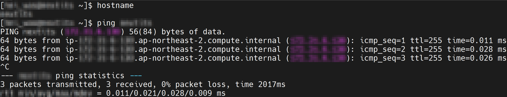
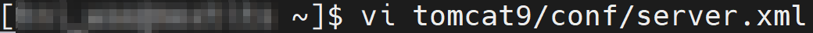
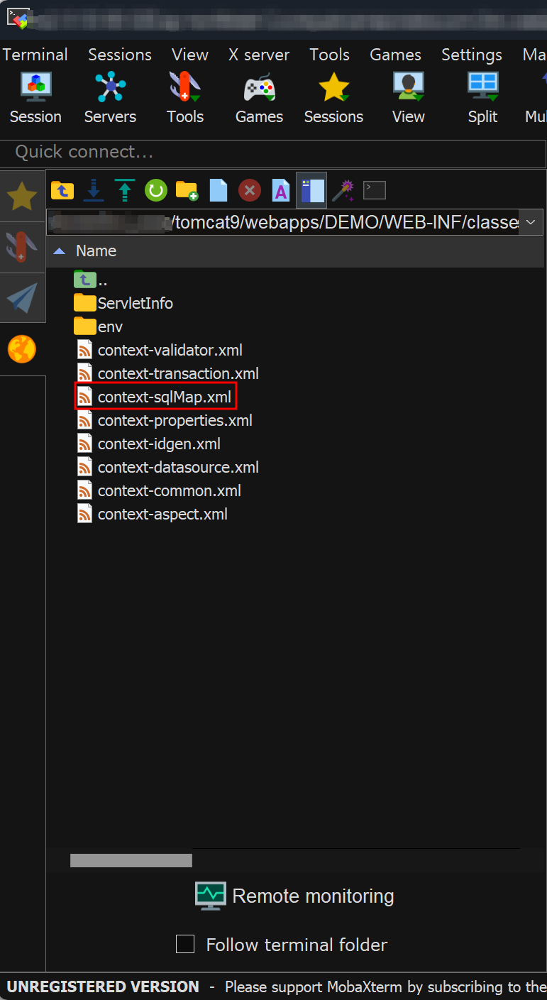

# POWERMDD.BMS : 개발 Server

<!-- Remark -->
::: tip <Badge type="tip" text="Remark" vertical="middle" /> 
-  license.txt와 PowerMDD_1.1.jar 파일은 POWERMDD 개발 Server 설치시 필요한 파일이고 key 파일은 POWERMDD Client 설치 후 로그인하기 전에 필요한 파일입니다.<br/>

- <span class="spanEx"> LicenseKey 디렉토리를 관리자에게 요청하기 전에 개발서버 Hostname, IP주소, WAS PORT 정보가 필요합니다. </span>
:::
<!-- -->

## 1. LicenseKey 디렉토리 : license.txt, PowerMDD_1.1.jar, key파일
<b class="font20"> 1) Hostname </b> <br/>
SSH 접속 Tool에  ‘<b>hostname</b>’ 을 입력하여 Hostname명을 확인합니다. <br/>


<b class="font20"> 2) IP주소 </b> <br/>
SSH 접속 Tool에 ‘<b>ping</b> <b class="spanEx">hostname명</b>’ 입력하여 IP를 확인합니다. <br/>


<b class="font20"> 3) WAS Port (Tomcat 사용) </b> <br/>
WAS가 설치된 경로에 server.xml 파일을 열어서 Port을 확인할 수 있습니다. <br/>
<span class="font18"> ① SSH 접속 Tool에 vi 명령어로 port번호를 확인할 수 있는 파일을 엽니다. </span> <br/>


<span class="font18"> ② 해당 파일을 열고 port번호를 확인합니다. </span> <br/>


<b class="font20"> 4) LicenseKey 디렉토리 </b> <br/>
관리자에게 가 – 다 의 정보를 보내면 License를 받을 수 있습니다. <br/>


## 2. Meta DB 파일
POWERMDD의 데이터베이스는 Meta DB, 업무 DB 2가지 종류가 있습니다. <br/>

<b class="font20"> 1) Meta DB 세팅</b>(PostgreSQL 사용) <br/>
POWERMDD 서버에 있는 모든 정보 체계를 저장하고 있는 데이터베이스입니다. <br/>
<b class="font18"> (1) User 계정 생성 </b>  <span span class="spanEx2">Ex) 계정 : democtl</span> <br/>
<span class="font18"> ① 계정 생성 전에 모든 권한이 설정된 계정으로 로그인합니다. </span> <br/>
<br/>

<span class="font18"> ② Meta DB 세팅할 데이터베이스에 접속합니다. </span> <br/>
<br/>

<span class="font18"> ③ Meta DB에 사용할 계정을 생성하면서 권한도 같이 할당해줍니다.</span> <br/>
<br/>
<!-- Remark -->
::: tip <Badge type="tip" text="Remark" vertical="middle" /> 
- superuser : 권한(룰) 부여
:::
<!-- -->

<span class="font18"> ④ 생성한 계정에 사용할 암호를 입력합니다. </span> <br/>
<br/>

<span class="font18"> ⑤ 데이터베이스를 생성하고 생성한 데이터베이스에 소유자를 생성한 계정으로 지정한다. 
단, 데이터베이스는 superuser만 생성할 수 있다. </span> <br/>
<br/>
<!-- Remark -->
::: tip <Badge type="tip" text="Remark" vertical="middle" /> 
- database database명 : 데이터베이스명
- owner 계정명 : 소유자명
- encoding ‘UTF8’ : 인코딩 UTF8 지정
- template template0 : 템플릿 데이터베이스, 초기 Object만으로 구성된 데이터베이스 템플릿
:::
<!-- -->

<span class="font18"> ⑥ 데이터베이스 목록을 조회하여 잘 생성되었는지 확인합니다. </span> <br/>
<br/>

<b class="font18"> (2) 데이터베이스 세팅 </b> <br/>
<span class="font18"> ① 데이터베이스 Tool(TablePlus 사용)을 이용해서 Meta DB에 접속합니다. </span> <br/>
<br/>

<span class="font18"> ② POWERMDD의 정보들을 저장할 수 있는 Meta DB에 들어갈 테이블들을 생성합니다. </span> <br/>
<br/>

<span class="font18"> ③ 테이블에 들어갈 값들 중에 유일한 값, Primary key 값을 생성하기 위해 Sequence도 생성합니다.</span> <br/>
<br/>

<span class="font18"> ④ 생성한 테이블에 기본적으로 들어갈 Data을 insert하여 commit합니다. </span> <br/>
<!-- Remark -->
::: tip <Badge type="tip" text="Remark" vertical="middle" /> 
insert하기 전에 SYSID, GROUPID 컬럼에 들어갈 값을 PROJECT명으로 변경합니다.
:::
<!-- -->
<br/>

<b class="font20"> 2) 업무 DB 세팅</b>(MySQL 사용) <br/>
해당 업무 서버에 있는 모든 정보 체계를 저장하고 있는 데이터베이스입니다. <br/>
<b class="font18"> (1) User 계정 생성 </b> <span span class="spanEx2">Ex) 계정 : demo</span> <br/>
<span class="font18"> ① 업무 DB 세팅할 데이터베이스에 접속합니다. </span> <br/>
<br/>

<span class="font18"> ② 계정정보를 생성하기 위해 데이터베이스로 접속합니다. </span> <br/>
<br/>

<span class="font18"> ③ Meta DB에 사용할 계정을 생성과 사용할 암호를 입력합니다.</span> <br/>
<br/>

<!-- Remark -->
::: tip <Badge type="tip" text="Remark" vertical="middle" /> 
- 내부IP접속 : ‘계정ID’@localhost
- 외부IP접속 : ‘계정ID’@‘%’
:::
<!-- -->

<span class="font18"> ④ 새로운 데이터베이스를 생성합니다. </span> <br/>
<br/>

<span class="font18"> ⑤ 생성한 데이터베이스 및 테이블에 권한을 주고 로컬 및 원격에서도 접속이 가능하도록 설정합니다. </span> <br/>
<br/>

<span class="font18"> ⑥ 설정한 권한을 적용합니다. </span> <br/>
<br/>

<span class="font18"> ⑦ 데이터베이스 목록을 조회하여 잘 생성되었는지 확인합니다. </span><br/>
<br/>

## 3. BMSCTX 디렉토리
WAS에 탑재되는 Middleware 서버로 다수의 Client(DX)로부터 다양한 요청에 대하여 필요한 기능을 제공합니다.

<b class="font20"> 1) BMSCTX : CONTEXT 구성 </b> <br/>

<span class="font18"> (1) POWERMDD을 실행할 파일들이 들어있는 BMSCTX 디렉토리를 WAS 설치 경로에 세팅합니다. </span> <br/>
<br/>

<span class="font18"> (2) 관리자에게 받은 license.txt는 BMSCTX 디렉토리 안에, PowerMDD_1.1.jar 파일은 ‘BMSCTX/WEB-INF/lib’에 세팅합니다. </span> <br/>

<span class="font18"> ① license.txt </span> &emsp;&emsp;&emsp;&emsp;&emsp;&emsp;&emsp;&emsp;&emsp;&emsp;&emsp;&emsp;&emsp;
<span class="font18"> ② PowerMDD_1.1.jar </span> <br/>

&emsp;&emsp;
<br/>

<b class="font20"> 2) ProcessBuilder_config.xml : BMSCTX 환경파일 세팅 </b> <br/>

<span class="font18"> (1) 먼저 BMSCTX 세팅하기 전에 PMDD 디렉토리 안에 개발에 대한 자바, xml 소스, 여러 가지 파일들 저장할 수 있는 디렉토리를 생성합니다. </span> <br/>
<br/>

<span class="font18"> (2) BMSCTX 디렉토리 안에 PowerMDD 실행환경 파일인 processbuilder_config.xml을 실행합니다. processbuilder_config.xml는 프로젝트, DB 정보, MAC 주소 등 등록하는 파일입니다. </span> <br/>
<br/>

<span class="font18"> (3) processbuilder_config.xml 안에는 &lt;Projects&gt;, &lt;Common&gt;, &lt;CONNECTION&gt;, &lt;MAC&gt;이 있습니다. </span> <br/>
```xml
<?xml version="1.0" encoding="utf-8"?>
<Processbuilder Version="CL1">
  <!-- 1. -->
  <Projects>  </Projects>

  <!-- 2. -->
  <Common>  </Common>

  <!-- 3. -->
  <CONNECTIONS>  </CONNECTIONS>

  <!-- 4. -->
  <MAC>  </MAC>
</Processbuilder>
```

<b class="font18"> ① &lt;Project&gt; </b> <br/>
개발할 프로젝트들을 등록하는 부분입니다.

<b class="font18"> ② &lt;Common&gt; </b> <br/>

<b class="font18"> ③ &lt;CONNECTION&gt;</b> <br/>
Meta DB, 업무 DB 연결 정보를 설정하는 부분입니다.

<b class="font18"> ④ &lt;MAC&gt; </b> <br/>
POWERMDD을 사용할 사용자 MAC 주소를 입력하는 부분입니다.

<!-- Remark -->
::: tip <Badge type="tip" text="Remark" vertical="middle" /> 
MAC 주소를 등록하지 않고 POWERMDD 로그인을 하면 MAC 주소를 등록하라는 알림창이 나오면서 POWERMDD을 접속할 수 없습니다.
:::
<!-- -->

<span class="font18"> (4) </span><b class="font18">&lt;Projects&gt;</b>  <br/>
&lt;Projects&gt; 안에 &lt;<b class="spanEx">사용할 PROJECT명</b>&gt; &lt;/<b class="spanEx">사용할 PROJECT명</b>&gt;을 입력하고 &lt;<b class="spanEx">사용할 PROJECT명</b>&gt; 안에는 &lt;DB-CONNECTION&gt;, &lt;DATAMODEL&gt;, &lt;UX-DESIGNER&gt;, &lt;FILESYSTEM-LOCATION&gt;, &lt;TEST-EXE&gt;, &lt;BUILD&gt;, &lt;SERVER&gt;, &lt;COMPILE&gt;이 있습니다.<br/>
```xml
<!-- 1. -->
<Projects>
  <DEMO>
    <!-- 1. -->
    <DB-CONNECTION>      </DB-CONNECTION>

    <!-- 2. -->
    <DATAMODEL>      </DATAMODEL>

    <!-- 3. -->
    <UX-DESIGNER>      </UX-DESIGNER>

    <!-- 4. -->
    <FILESYSTEM-LOCATION>      </FILESYSTEM-LOCATION>

    <!-- 5. -->
    <TEST-EXE>      </TEST-EXE>

    <!-- 6. -->
    <BUILD>      </BUILD>

    <!-- 7. -->
    <SERVER>      </SERVER>

    <!-- 8. -->
    <COMPILE>      </COMPILE>
  </DEMO>
</Projects>
```

<b class="font18"> ① &lt;DB-CONNECTION&gt; </b> <br/>
Meta DB, 업무 DB의 별칭을 입력하는 부분입니다. <br/>
```xml
<!-- 1. -->
<DB-CONNECTION>
  <WASTYPE>tomcat</WASTYPE>
  <CONTROL_DB>DEMOCTL</CONTROL_DB>
  <DEFAULT_DB>DEMODB</DEFAULT_DB>
  <TEST_DB>TESTDB</TEST_DB>                  
</DB-CONNECTION>
```
- <b>&lt;WASTYPE&gt;</b> : 현재 사용하고 있는 WAS를 설정합니다.

- <b>&lt;CONTROL_DB&gt;</b> : Meta DB의 별칭을 설정합니다.

- <b>&lt;DEFAULT_DB&gt;</b> : 업무 DB의 별칭을 설정합니다.

- <b>&lt;TEST_DB&gt;</b> : Service Model 테스트 시 추가 연결 DB의 별칭을 설정합니다.

<b class="font18"> ② &lt;DATAMODEL&gt; </b> <br/>
POWERMDD 구성요소에 DataModel의 파일들을 저장하는 부분입니다. <br/>
```xml
<!-- 2. -->
<DATAMODEL>
  <MODELDATA>/.../tomcat9/webapps/BMSCTX/PMDD/DEMO/ModelData</MODELDATA>
  <MODELHISTORY>/.../tomcat9/webapps/BMSCTX/PMDD/DEMO/ModelHistory</MODELHISTORY>
</DATAMODEL>
```
- <b>&lt;MODELDATA&gt;</b> : DataModel에 파일들을 저장되는 경로입니다.

- <b>&lt;MODELHISTORY&gt;</b> <br/>
DataModel의 내역들이 저장되는 경로입니다. 만약 저장했던 파일이 깨지거나 저장하기 전으로 돌리고 싶다면 해당 경로로 들어와서 수정할 수 있습니다.

<!-- Remark -->
::: tip <Badge type="tip" text="Remark" vertical="middle" /> 
- 해당 경로에 ModelData와 ModelHistory 디렉토리를 생성해야합니다.<br/>
<br/>

- ModelData 디렉토리 안에는 DataModelInfo.xml 파일을 꼭 넣어야 합니다. DataModelInfo.xml은 데이터베이스에 따라 쿼리를 변경하거나 DataModel에 필요한 정보들이 있기 때문에 꼭 필요합니다.<br/>
<br/>
:::
<!-- -->

<b class="font18"> ③ &lt;UX-DESIGNER&gt;</b> <br/>
Context 경로나 문자 셋, 화면 IP Port 정보를 설정하는 부분입니다. <br/>
```xml
<!-- 3. -->
<UX-DESIGNER>
  <UX_TEMP_FOLDER>/.../tomcat9/webapps/BMSCTX/PMDD/DEMO/temp</UX_TEMP_FOLDER>
  <UX_MENU_FILE>wizdesigner.xml</UX_MENU_FILE>
  <UX_ROOT>/.../tomcat9/webapps/BMSCTX/PMDD/DEMO/layout</UX_ROOT>
  <UX_CONTEXT_ROOT>/.../tomcat9/webapps/DEMO</UX_CONTEXT_ROOT>
  <UX_ContextPath>DEMO</UX_ContextPath>
  <UX_Server>XXX.XXX.XXX.XXX:XXXX</UX_Server>
  <UXResponseCharset></UXResponseCharset>
  <UXRequestCharset></UXRequestCharset>
  <GROUP_PAGECOUNT>10</GROUP_PAGECOUNT>
  <UI></UI>
</UX-DESIGNER>
```
- <b>&lt;UX_ROOT&gt;</b> <br/>
POWERMDD 기능 요소 중 View Designer의 내역들이 저장되는 경로입니다. 만약 저장했던 파일이 깨지거나 저장하기 전으로 돌리고 싶다면 해당 경로로 들어와서 수정할 수 있습니다.

- <b>&lt;UX_CONTEXT_ROOT&gt;</b> : context 경로입니다.

- <b>&lt;UX_ContextPath&gt;</b> : ContextPath를 나타냅니다.

- <b>&lt;UX_Server&gt;</b> : 화면 IP와 Port 정보를 입력합니다.

<!-- Remark -->
::: tip <Badge type="tip" text="Remark" vertical="middle" /> 
해당 경로에 temp와 layout 디렉토리를 생성해야합니다.<br/>
<br/>
:::
<!-- -->

<b class="font18"> ④ &lt;FILESYSTEM-LOCATION&gt; </b> <br/>
서버 파일 시스템의 파일 시스템 위치를 설정합니다. <br/>
```xml
<!-- 4. -->
<FILESYSTEM-LOCATION>
  <META-LOCATION>/.../tomcat9/webapps/BMSCTX/PMDD/DEMO/bms</META-LOCATION>
  <DOC-LOCATION>/.../tomcat9/webapps/BMSCTX/PMDD/DEMO/doc</DOC-LOCATION>
  <DOC-BOARD-ROOT>/.../tomcat9/webapps/BMSCTX/PMDD/DEMO/doc</DOC-BOARD-ROOT>
  <BACKUP-META>/.../tomcat9/webapps/PMDD/DEMO/backup</BACKUP-META>
</FILESYSTEM-LOCATION>
```
<!-- Remark -->
::: tip <Badge type="tip" text="Remark" vertical="middle" /> 
해당 경로에 bms, doc, backup 디렉토리를 생성해야합니다.<br/>
<br/>
:::
<!-- -->
<b class="font18"> ⑤ &lt;TEST-EXE&gt; </b> <br/>
Query Developer 테스트 시 ROW 크기를 설정합니다. <br/>
```xml
<!-- 5. -->
<TEST-EXE>
  <MAXLOOPCNT>50</MAXLOOPCNT>
  <RECORDSIZE>5000</RECORDSIZE>    
  <LOCALON>YES</LOCALON>
</TEST-EXE>
```
<b class="font18"> ⑥ &lt;BUILD&gt; </b> <br/>
POWERMDD 빌드 시 생성되는 소스 위치를 설정합니다. <br/>
```xml
<!-- 6. -->
<BUILD>
  <SRCTYPE>EGOV</SRCTYPE>
  <SRCVERSION>4</SRCVERSION>               
  <BATCHSRCTYPE>bean</BATCHSRCTYPE>
  <DATAACCESS>MYBATIS</DATAACCESS>
  <SQLSESSION></SQLSESSION>
  <GENLOCATION>/.../tomcat9/webapps/BMSCTX/PMDD/DEMO/tlog</GENLOCATION>
  <CURRENTGEN>/.../tomcat9/webapps/BMSCTX/PMDD/DEMO/rsrc</CURRENTGEN>
  <SQLLOCATION>/.../tomcat9/webapps/BMSCTX/PMDD/DEMO/xmlctl</SQLLOCATION>
  <RUNNINGCLASS>/.../tomcat9/webapps/DEMO/WEB-INF/classes</RUNNINGCLASS>
  <CLASSLOADER>WAS</CLASSLOADER>
  <HISTORYGEN>/.../tomcat9/webapps/BMSCTX/PMDD/DEMO/hsrc</HISTORYGEN>
  <XML>YES</XML>
  <USER-EXCEPTION>YES</USER-EXCEPTION>
  <USER-TRANSACTION>YES</USER-TRANSACTION>
  <TRANSACTIONMANAGER>txManager</TRANSACTIONMANAGER>
  <XMLBUILDTYPE>YES</XMLBUILDTYPE>
  <SoruceCharset></SoruceCharset>
  <GEN2Charset>YES</GEN2Charset>
  <EGOVFRAMEWORK>
    <REQUESTMAPPING_RULE>/{CLASS}_{SERVICEID}.sa</REQUESTMAPPING_RULE>
    <CONTEXT_XML_HOME>/.../tomcat9/webapps/DEMO/WEB-INF/classes/spring</CONTEXT_XML_HOME>
    <SQL_MAP_ROOT>/.../tomcat9/webapps/DEMO/WEB-INF/classes/sqlmap/sql</SQL_MAP_ROOT>
    <EBUILD_SQLMAP_LEVEL>1</EBUILD_SQLMAP_LEVEL>
    <EBUILD_JAVA_CONTROL>web</EBUILD_JAVA_CONTROL>
    <EBUILD_JAVA_SERVICE>service</EBUILD_JAVA_SERVICE>
    <EBUILD_JAVA_DAO>dao</EBUILD_JAVA_DAO>
    <EBUILD_JAVA_IMPL>Impl</EBUILD_JAVA_IMPL>
    <MYBATIS_SESSION_MANAGER>mybatis.sample.SqlSessionManager</MYBATIS_SESSION_MANAGER>
    <DATASOURCE>context-datasource.xml</DATASOURCE>
    <CONTEXT_SQLMAP>context-sqlMap.xml</CONTEXT_SQLMAP>
    <ANNOTATION_RULE>{CLASS}{MENUID}</ANNOTATION_RULE>
    <SQL_MAP_NAMESPACE_RULE>{CLASS}_{MENUID}</SQL_MAP_NAMESPACE_RULE>
    <SQL_MAP_ROOT_PATHNAME>sqlmap/sql</SQL_MAP_ROOT_PATHNAME>
    <SQL_MAP_DTD_URL>http://mybatis.org/dtd/mybatis-3-mapper.dtd</SQL_MAP_DTD_URL>
    <SQL_MAP_DTD_ORG>-//mybatis.org//DTD Mapper 3.0//EN</SQL_MAP_DTD_ORG>
    <SQL_MAP_CONFIG_DTD_URL>http://mybatis.org/dtd/mybatis-3-config.dtd</SQL_MAP_CONFIG_DTD_URL>
    <SQL_MAP_CONFIG_DTD_ORG>-//mybatis.org//DTD Config 3.0//EN</SQL_MAP_CONFIG_DTD_ORG>
  </EGOVFRAMEWORK>
</BUILD>
```
- <b>&lt;SRCTYPE&gt;</b> : 빌드 타입을 설정합니다.

- <b>&lt;SRCVERSION&gt;</b> : MyBatis, 전자정부 최신 소스 버전을 설정합니다. SRCVERSION이 생략된 경우 기본값은 3버전으로 설정됩니다.

- <b>&lt;DATAACCESS&gt;</b> : iBatis 또는 MyBatis를 설정합니다.

- <b>&lt;GENLOCATION&gt;, &lt;CURRENTGEN&gt;</b> : 빌드 시 자바 소스가 저장되는 경로입니다.

- <b>&lt;SQLLOCATION&gt;</b> : 빌드 시 xml 소스가 저장되는 경로입니다.

- <b>&lt;RUNNINGCLASS&gt;</b> : 빌드 시 class파일이 저장되는 경로입니다.

- <b>&lt;HISTORYGEN&gt;</b> : 빌드 시 소스 떨어지는 경로입니다.

- <b>&lt;REQUESTMAPPING_RULE&gt;</b> : 리퀘스트 매핑 네이밍 규칙을 설정합니다.

- <b>&lt;CONTEXT_XML_HOME&gt;</b> : 스프링 xml 경로를 설정합니다.

- <b>&lt;SQL_MAP_ROOT&gt;</b> : sql map 소스가 떨어지는 경로입니다.

- <b>&lt;EBUILD_.....&gt;</b> : MVC 모델 소스 네이밍을 설정합니다.

- <b>&lt;DATASOURCE&gt;</b> : DB 연결 정보 xml파일입니다.

- <b>&lt;CONTEXT_SQLMAP&gt;</b> : 쿼리 정보 xml파일입니다.

- <b>&lt;ANNOTATION_RULE&gt;</b> : 어노테이션 네이밍 규칙을 설정합니다.

- <b>&lt;SQL_MAP_NAMESPACE_RULE&gt;</b> : sql문 네이밍 룰 규칙을 설정합니다.

- <b>&lt;SQL_MAP_ROOT_PATHNAME&gt;</b> : sql문 xml 소스를 저장하는 경로입니다.

- <b>&lt;SQL_MAP_DTD_URL&gt;, &lt;SQL_MAP_DTD_ORG&gt;, &lt;SQL_MAP_CONFIG_DTD_URL&gt;, &lt;SQL_MAP_CONFIG_DTD_ORG&gt;</b> : ibatis 환경을 설정합니다.

<!-- Remark -->
::: tip <Badge type="tip" text="Remark" vertical="middle" /> 
해당 경로에 tlog, rsrc, xmlctl, hsrc 디렉토리를 생성해야합니다.<br/>
<br/>
:::
<!-- -->

<b class="font18"> ⑦ &lt;SERVER&gt; </b> <br/>
해당 서버의 정보들을 설정합니다. <br/>
```xml
<!-- 7. -->
<SERVER>
  <REAL_COPY_TYPE>FTP</REAL_COPY_TYPE>
  <REAL_SQL_MAP_ROOT>/TEST/SQL</REAL_SQL_MAP_ROOT>
  <REAL_CLASS_ROOT>/TEST/UUU</REAL_CLASS_ROOT>
  <REAL_IP>XXX.XXX.XXX.XXX</REAL_IP>
  <REAL_ID>서버 계정 ID</REAL_ID>
  <REAL_PWD>서버 계정 암호</REAL_PWD>
</SERVER>
```
- <b>&lt;REAL_COPY_TYPE&gt;</b> : 서버 프로토콜 타입을 설정합니다.

- <b>&lt;REAL_IP&gt;</b> : 서버 IP 정보를 설정합니다.

- <b>&lt;REAL_ID&gt;</b> : 서버 계정 ID을 설정합니다.

- <b>&lt;REAL_PWD&gt;</b> : 서버 계정 암호를 설정합니다.

<b class="font18"> ⑧ &lt;COMPILE&gt; </b> <br/>
POWERMDD 컴파일 시 생성되는 소스 위치를 설정합니다. <br/>
```xml
<!-- 8. -->
<COMPILE>
  <BUILD></BUILD>
  <CLASSPATH>/.../tomcat9/webapps/DEMO/WEB-INF/classes</CLASSPATH>
  <OPTION></OPTION>
  <LIB>/.../tomcat9/webapps/BMSCTX/jclib</LIB>
  <EXTDIR>false</EXTDIR>
  <DELIM>:</DELIM>
</COMPILE>
```
- <b>&lt;CLASSPATH&gt;</b> : 컴파일한 Class Path 정보를 설정합니다.

- <b>&lt;LIB&gt;</b> : POWERMDD 빌드 시 필요한 jar 파일 참조 경로를 설정합니다.

<span class="font18"> (5) </span><b class="font18">&lt;Common&gt;</b>  <br/>
```xml
<!-- 2. -->
<Common>
  <ADMIN></ADMIN>
  <SECURITY>YES</SECURITY>
  <TEMPFOLDER>/.../tomcat9/webapps/BMSCTX/PMDD/DEMO/temp</TEMPFOLDER>
  <DxRequestCharset></DxRequestCharset>
  <DxResponseCharset>utf-8</DxResponseCharset>
  <InputCharSet></InputCharSet>
  <SoruceCharset>utf-8</SoruceCharset>
  <DebugOn>no</DebugOn>
  <CLASSAUTOLOAD>true</CLASSAUTOLOAD>
  <BUILDTYPE></BUILDTYPE>
  <NEWLINE>n</NEWLINE>
  <InputCharSet></InputCharSet>
  <BACKUP_DUMPFILE>/>/...//tomcat9/webapps/BMSCTX/PMDD/backup</BACKUP_DUMPFILE>
</Common>
```

<span class="font18"> (6) </span><b class="font18">&lt;CONNECTIONS&gt;</b>  <br/>
&lt;MetaDB&gt;, &lt;업무DB&gt; 생성해서 연결정보를 설정합니다.<br/>
```xml
<!-- 3. -->
<CONNECTIONS>
  <DEMOCTL>
    <TYPE>direct</TYPE>
    <USER>DB계정</USER>
    <PASSWORD>DB계정 암호</PASSWORD>
    <LOOKUP_NAME>DEMOCTL</LOOKUP_NAME>
    <PATH>jdbc:postgresql://XXX.XXX.XXX.XXX:XXXX/democtl</PATH>
    <WAS>tomcat</WAS>
    <DATABASE>postgresql</DATABASE>
    <DRIVER> </DRIVER>
  </DEMOCTL>
  <DEMODB>
    <TYPE>direct</TYPE>
    <USER>DB계정</USER>
    <PASSWORD>DB계정 암호</PASSWORD>
    <LOOKUP_NAME>DEMODB</LOOKUP_NAME>
    <PATH>jdbc:mysql://XXX.XXX.XXX.XXX:XXXX/demo?useSSL=false</PATH>
    <WAS>tomcat</WAS>
    <DATABASE>mysql</DATABASE>
    <DRIVER>com.mysql.cj.jdbc.Driver</DRIVER>
    <NOTE>Window-Service:MySQL80</NOTE>
  </DEMODB>
</CONNECTIONS>
```
- <b>&lt;USER&gt;</b> : DB 계정을 설정합니다.

- <b>&lt;PASSWORD&gt;</b> : DB 계정의 암호를 설정합니다.

- <b>&lt;PATH&gt;</b> : DB URL 정보를 설정합니다.

- <b>&lt;WAS&gt;</b> : 어떤 WAS을 사용하고 있는지 설정합니다.

- <b>&lt;DATABASED&gt;</b> : 어떤 DataBase을 사용하고 있는지 설정합니다.

- <b>&lt;DRIVER&gt;</b> : JDBC 드라이버를 설정합니다.

<span class="font18"> (7) </span><b class="font18">&lt;MAC&gt;</b>  <br/>

<span class="font18"> ① MAC 주소를 등록하기 전에 등록할 PC의 CMD 창을 열어서 MAC주소를 확인합니다. </span> <br/>
<br/>

<span class="font18"> ② 확인한 MAC주소를 등록합니다. </span> <br/>
```xml
<!-- 4. -->
<MAC>
  <ADDRESS MAC="맥주소">PMDD</ADDRESS>
</MAC>
```

<b class="font20"> 3) BMSCTX의 web.xml의 구성 </b> <br/>

<span class="font18"> (1) BMSCTX의 환경설정하기 위해 ‘BMSCTX\WEB-INF’에서 web.xml을 클릭합니다. </span> <br/>
<br/>

<span class="font18"> (2) HostName, TempUploadPath, FileRootPath을 설정합니다. </span> <br/>
```xml
<init-param> 
    <param-name>HostName</param-name>
    <param-value>호스트명</param-value>
</init-param> 
<init-param>
    <param-name>RequestCharset</param-name>
    <param-value>UTF-8</param-value>
</init-param>
<init-param>
    <param-name>ResponseCharset</param-name>
    <param-value>UTF-8</param-value>
</init-param>

<init-param>
  <param-name>TempUploadPath</param-name>
  <param-value>/.../tomcat9/webapps/BMSCTX/temp</param-value>
</init-param> 
<init-param>
  <param-name>FileRootPath</param-name>
  <param-value>/.../tomcat9/webapps/BMSCTX/temp/files</param-value>
</init-param>  
```
- HostName : 해당 서버의 HostName을 설정합니다.

- TempUploadPath : 파일 업로드시 임시 업로드 파일 위치를 설정합니다.

- FileRootPath : 서버 파일 시스템 관리의 파일 시스템의 root 위치를 설정합니다.

## 4. WebaApplication명 디렉토리
Lib, Class, Css, jsp 등 웹 애플리케이션 실행파일들의 보관 디렉토리입니다.

<b class="font20"> 1) WebApplication : CONTEXT 구성 </b> <br/>
개발할 업무 디렉토리를 WAS 설치 경로에 세팅하고 해당 Project명으로 변경합니다.
<br/>

<b class="font20"> 2) web.xml의 구성 </b> <br/>

<span class="font18"> (1) 업무 디렉토리의 환경설정을 위해 ‘</span><span class="spanEx2">WebApplication명</span><span>\WEB-INF’에서 web.xml을 클릭합니다. </span> <br/>
<br/>

<span class="font18"> (2) &lt;display-name&gt;을 설정합니다. </span> <br/>
```xml
<?xml version="1.0" encoding="UTF-8"?>
<web-app id="WebApp_ID" version="4.0" xmlns="http://xmlns.jcp.org/xml/ns/javaee"
    xmlns:xsi="http://www.w3.org/2001/XMLSchema-instance"
    xsi:schemaLocation="http://xmlns.jcp.org/xml/ns/javaee http://xmlns.jcp.org/xml/ns/javaee/web-app_4_0.xsd">
	<display-name>DEMO</display-name>
```

<span class="font18"> (3) encodingFiter와 View에서 action 처리하는 url-pattern를 설정합니다. </span> <br/>
```xml
<filter-mapping>
    <filter-name>encodingFilter</filter-name>
    <url-pattern>*.sa</url-pattern>
</filter-mapping>

....

<servlet-mapping>
  <servlet-name>action</servlet-name>
  <url-pattern>*.sa</url-pattern>
</servlet-mapping>
```

<!-- Remark -->
::: tip <Badge type="tip" text="Remark" vertical="middle" /> 
BMSCTX폴더에 processbuilder_config.xml 파일에서도 &lt;EGOVFRAMEWORK&gt; ➝ &lt;REQUESTMAPPING_RULE&gt; 부분에도 설정하는 곳이 있습니다. 안 맞을 경우 오류날 수 있으니 확인해야합니다.<br/>
:::
<!-- -->

<span class="font18"> (4) XMLCTL에서 xml파일 경로를 설정합니다. </span> <br/>
```xml
<init-param>
  <param-name>XMLCTL</param-name>
  <param-value>/.../tomcat9/webapps/BMSCTX/PMDD/DEMO/xmlctl</param-value>
</init-param>
```

<span class="font18"> (5) FileUpload에서 임시로 저장될 경로와 파일 업로드할 경로를 설정합니다. </span> <br/>
```xml
<servlet>
  <servlet-name>FileUpload</servlet-name>
  <servlet-class>egov.wizware.ria.FileUploadServlet</servlet-class>
  <init-param>
    <param-name>TEMP</param-name>
    <param-value>/.../tomcat9/webapps/DEMO/file/temp/</param-value>
  </init-param>
 <init-param>
    <param-name>REAL</param-name>
    <param-value>/.../tomcat9/webapps/DEMO/file/real/</param-value>
  </init-param>
 <init-param>
    <param-name>IMG</param-name>
    <param-value>file/real/</param-value>
  </init-param>
 <init-param>
    <param-name>IMGTEMP</param-name>
    <param-value>file/temp/</param-value>
  </init-param>
  <init-param> 
    <param-name>EXTENSION</param-name> 
    <param-value>jsp,java,com,exe,bat,class,java,jsp,html,js,css</param-value> 
  </init-param>
</servlet>
<servlet-mapping>
    <servlet-name>FileUpload</servlet-name>
    <url-pattern>/FileUpload.fup</url-pattern>
</servlet-mapping>
```

<b class="font20"> 3) spring 설정 </b> <br/>
<span class="font18"> (1) context-datasource.xml </span> <br/>
<span class="font18"> ① ‘</span><span class="spanEx2">WebApplication명</span><span>\WEB-INF/classes/spring’에 들어가서 context-datasource.xml을 클릭합니다. </span> <br/>
<br/>

<span class="font18"> ② 업무DB 데이터베이스를 추가한다. 계정과 계정암호는 globals.properties 부분에서 설정합니다. </span> <br/>
```xml
<!-- mysql -->
<bean id="dataSource-mysql" class="org.apache.commons.dbcp2.BasicDataSource" destroy-method="close">
    <property name="driverClassName" value="${Globals.DriverClassName}"/>
    <property name="url" value="${Globals.Url}" />
    <property name="username" value="${Globals.UserName}"/>
    <property name="password" value="${Globals.Password}"/>
</bean>
```

<span class="font18"> (2) context-sqlMap.xml </span> <br/>
<span class="font18"> ① ‘</span><span class="spanEx2">WebApplication명</span><span>\WEB-INF/classes/spring’에 들어가서 context-sqlMap.xml을 클릭합니다. </span> <br/>
<br/>

<span class="font18"> ② sqlMap-Confing 경로를 변경합니다. </span> <br/>
```xml
<bean id="sqlSession" class="org.mybatis.spring.SqlSessionFactoryBean">
  <property name="dataSource" ref="dataSource-mysql" />
  <property name="configLocation" value="classpath:sqlmap/sql/DEMO/DEMO-SqlMap-Config.xml" />
</bean> 
```

<span class="font18"> (3) context-transaction.xml </span> <br/>
<span class="font18"> ① ‘</span><span class="spanEx2">WebApplication명</span><span>\WEB-INF/classes/spring’에 들어가서 context-transaction.xml을 클릭합니다. </span> <br/> 
<br/>

<span class="font18"> ② transaction 설정하는 곳에 dataSource와 expression를 변경합니다. </span> <br/>
```xml
<!-- transaction 설정 -->
<bean id="txManager" class="org.springframework.jdbc.datasource.DataSourceTransactionManager">
  <property name="dataSource" ref="dataSource-mysql"/>
</bean>

<tx:advice id="txAdvice" transaction-manager="txManager">
  <tx:attributes>
    <tx:method name="*" rollback-for="Exception"/>
    <tx:method name="*" propagation="REQUIRED" rollback-for="Throwable"/>
  </tx:attributes>
</tx:advice>

<aop:config>
  <aop:pointcut id="requiredTx" expression="execution(* DEMO..*Impl.*(..))"/>
  <aop:advisor advice-ref="txAdvice" pointcut-ref="requiredTx" />
</aop:config>
```

<span class="font18"> (4) globals.properties </span> <br/>
<span class="font18"> ① ‘</span><span class="spanEx2">WebApplication명</span><span>\WEB-INF/classes/spring/env’에 들어가서 globals.properties을 클릭합니다. </span> <br/>
<br/>

<span class="font18"> ② 업무DB 데이터베이스의 정보들을 설정합니다. </span> <br/>
```properties
Globals.OsType = UNIX
Globals.DbType = mysql
Globals.UserName=DB계정
Globals.Password=DB계정 암호

#mysql
Globals.DriverClassName=com.mysql.cj.jdbc.Driver
Globals.Url=jdbc:mysql://XXX.XXX.XXX.XXX:XXXX/demo?useSSL=false&autoReconnect=true&allowPublicKeyRetrieval=true
```

- OsType : 해당 OS 타입을 WINDOWS 또는 UNIX 설정합니다.

- DbType : 어떤 DataBase을 사용하고 있는지 설정합니다.

- UserName : 업무 DB 계정을 설정합니다.

- Password : 업무 DB 계정의 암호를 설정합니다.

- DriverClassName : DataBase에 해당하는 Driver을 설정합니다.

- Url : DataBase에 해당하는 Url 정보를 설정합니다.

<span class="font18"> (5) egov-com-servlet.xml </span> <br/>
<span class="font18"> ① ‘</span><span class="spanEx2">WebApplication명</span><span>\WEB-INF/classes/spring/ServletInfo’에 들어가서 egov-com-servlet.xml을 클릭합니다. </span> <br/>
<br/>

<span class="font18"> ② 패키지와 Ria부분을 수정합니다. </span> <br/>
- 패키지 내 Controller, Service, Repository 클래스의 auto detect를 위한 mvc 설정합니다.
```xml
<!-- 패키지 내 Controller, Service, Repository 클래스의 auto detect를 위한 mvc 설정 -->
<context:component-scan base-package="DEMO.*">
    <context:include-filter
        type="annotation"
        expression="org.springframework.stereotype.Controller"/>
</context:component-scan>
```

- property 정보들을 각각 설정합니다.
```xml
<!-- Ria 연결 -->
<bean id="riaAdaptor" class="egov.wizware.ria.UIWizAdaptor">
    <property name="devlog" value="yes"/>
    <property name="errorlog" value="yes"/>
    <property name="trace" value="yes"/>
    <property name="session" value="false"/>
    <property name="sysid" value="DEMO"/>
    <property
        name="xmlctl"
        value="/.../tomcat9/webapps/BMSCTX/PMDD/DEMO/xmlctl"/>
    <property
        name="exceldown"
        value="/.../tomcat9/webapps/BMSCTX/PMDD/DEMO/Temp"/>
    <property name="dbdriver" value="org.postgresql.Driver"/>
    <property name="dburl" value="jdbc:postgresql://XXX.XXX.XXX.XXX:XXXX/democtl"/>
    <property name="dbuser" value="DB계정"/>
    <property name="dbpassword" value="DB계정 암호"/>
</bean>

<!-- Ria 연결 -->
<bean id="riaView" class="egov.wizware.ria.AjaxWizView">
    <property name="trace" value="yes"/>
    <property name="session" value="false"/>
    <property name="sysid" value="DEMO"/>
    <property
        name="xmlctl"
        value="/.../tomcat9/webapps/BMSCTX/PMDD/DEMO/xmlctl"/>
    <property name="notfoundgeturl" value="/DEMO/jsp/bbb.jsp"/>
    <property name="errorlog" value="yes"/>
    <property name="dbdriver" value="org.postgresql.Driver"/>
    <property name="dburl" value="jdbc:postgresql://XXX.XXX.XXX.XXX:XXXX/democtl"/>
    <property name="dbuser" value="DB계정"/>
    <property name="dbpassword" value="DB계정 암호"/>
</bean>
```

<b class="fontB">[riaAdaptor] </b>
- sysid : Project명을 입력합니다.

- xmlctl : xml 소스가 저장되는 경로입니다.

- exceldown : 엑셀 파일 업로드시 임시 업로드 파일 위치를 설정합니다.

- db..... : Meta DB의 Database 정보들을 입력합니다.

<b class="fontB">[riaView] </b>
- sysid : Project명을 입력합니다.

- xmlctl : xml 소스가 저장되는 경로입니다.

- db..... : Meta DB의 Database 정보들을 입력합니다.

<style type='text/css'>
  [class*="boxBorder"] { border: 1px solid #bbb; }
  [class*="font20"] { font-size: 20px }
  [class*="font18"] { font-size: 18px }
  [class="spanBtn"] { border: 1px solid #bbb;border-radius: 4px;padding: 3px;background:white; color:dimgrey; }
  [class="spanEx2"] { font-size: 18px; color: #00a4ff; }
  [class="spanEx"] { color: #00a4ff; }
  [class="fontB"] { color: rgb(106, 139, 173); font-size:18px }
</style>