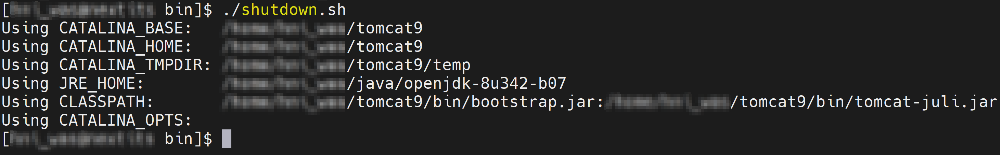
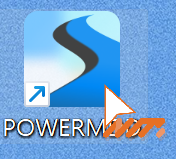

# POWERMDD DX

## 1. WAS 실행
개발 서버를 수정했으므로 재기동을 해야 POWERMDD가 정상적으로 작동이 됩니다.<br/>

<b class="font20"> 1) bin 파일 </b> <br/>
SSH 접속 Tool에 ‘<b>cd</b> <b class="spanEx">Was경로</b><b>/bin</b>’을 입력한다. <br>


<!-- Remark -->
::: tip <Badge type="tip" text="Remark" vertical="middle" /> 
Was을 시작, 중지, 기타 파일이 있는 디렉토리입니다. 시작, 중지 파일에는 sh와 bat파일이 있는데 sh 파일은 유닉스 시스템이고 bat파일은 윈도우 시스템입니다.<br/>
:::
<!-- -->

<b class="font20"> 2) WAS 재기동 </b> <br/>
<span class="font18"> (1) WAS가 실행되어 있다면 SSH 접속 Tool에 ‘<b>./shutdown.sh</b>’을 입력해서 WAS을 중지합니다. </span> <br/>


<span class="font18"> (2) SSH 접속 Tool에 ‘<b>./startup.sh</b>’을 입력해서 WAS을 시작합니다. </span> <br/>


## 2. POWERMDD 실행
<b class="font20"> 1) Project 등록 </b> <br/>
<span class="font18"> (1) POWERMDD 로그인하기 전에 POWERMDD 설치 경로에 들어가서 DXDBInit.xml 클릭합니다. </span> <br/>


<span class="font18"> (2) POWERMDD로 개발할 프로젝트명을 입력합니다. </span> <br/>
```xml
<SYSTEM>
  <SYSID>DEMO</SYSID>
</SYSTEM>
```

<b class="font20"> 2) POWERMDD 로그인 </b> <br/>
<span class="font18"> (1) 관리자에게 받은 접속 보안 KEY 파일을 넣습니다. </span> <br/>


<span class="font18"> (2) 바로 로그인 화면으로 변경된 것을 확인할 수 있습니다. </span> <br/>
 

<span class="font18"> (3) ID와 암호는 Meat DB에서 ‘PUS01ZT’ 테이블에서 정보를 확인한 후 로그인을 합니다. </span> <br/>
 

<span class="font18"> (4) 로그인을 성공했다면 POWERMDD가 정상적으로 설치되었다는 것을 확인할 수 있습니다. </span> <br/>



<style type='text/css'>
  [class*="boxBorder"] { border: 1px solid #bbb; }
  [class*="font20"] { font-size: 20px }
  [class*="font18"] { font-size: 18px }
  [class="spanBtn"] { border: 1px solid #bbb;border-radius: 4px;padding: 3px;background:white; color:dimgrey; }
  [class="spanEx2"] { font-size: 18px; color: #00a4ff; }
  [class="spanEx"] { color: #00a4ff; }
  [class="fontB"] { color: rgb(106, 139, 173); font-size:18px }
</style>