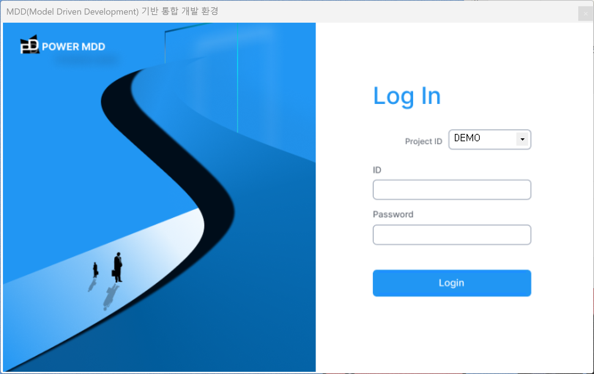

# POWERMDD.DX

## 1. License Key 파일
1)<b class="font20"> Hostname </b>  
SSH 접속 Tool에  ‘<b>hostname</b>’ 을 입력하여 Hostname명을 확인합니다.  

2)<b class="font20"> IP주소 </b>  
SSH 접속 Tool에 ‘<b>ping</b> <b class="spanEx">hostname명</b>’ 입력하여 IP를 확인합니다.  

3)<b class="font20"> WAS Port </b>  
WAS가 설치된 경로에 server.xml 파일을 열어서 Port번호를 확인할 수 있습니다.  

 ① SSH 접속 Tool에 vi 명령어로 Port번호를 확인할 수 있는 파일을 엽니다.   

 ② 해당 파일을 열고 Port번호를 확인합니다.   

4)<b class="font20"> LicenseKey 파일 </b>  
관리자에게 가 – 다의 정보를 보내면 License Key 파일을 받을 수 있습니다.  

## 2. POWERMDD 클라이언트 setup 파일
애플리케이션 개발을 위한 프로그램 Tool입니다.

1)<b class="font20"> WAS 실행 </b>  

개발 서버를 수정했으므로 재기동을 해야 POWERMDD가 정상적으로 작동이 됩니다. 

(1)<b class="font18"> bin 파일 </b>  

SSH 접속 Tool에 ‘<b>cd</b> <b class="spanEx">Was경로</b><b>/bin</b>’을 입력합니다.  

<!-- Remark -->
::: tip <Badge type="tip" text="Remark" vertical="middle" /> 
Was을 시작, 중지, 기타 파일이 있는 디렉토리입니다. 시작, 중지 파일에는 sh와 bat파일이 있는데 sh 파일은 유닉스 시스템이고 bat파일은 윈도우 시스템입니다. 
:::
<!-- -->

(2)<b class="font18"> WAS 재기동 </b>  

 ① WAS가 실행되어 있다면 SSH 접속 Tool에 ‘<b>./shutdown.sh</b>’을 입력해서 WAS을 중지합니다.   

 ② SSH 접속 Tool에 ‘<b>./startup.sh</b>’을 입력해서 WAS을 시작합니다.   

2)<b class="font20"> POWERMDD 실행 (설치부분은 POWERMDD 개요 매뉴얼 참고) </b>  

 (1) 바탕화면에 설치된 POWERMDD 프로그램을 더블클릭합니다.   

 (2) 해당 Default 프로젝트 ID를 입력 후,  Init Key File  버튼을 클릭하여 관리자에게 받은 접속 보안 KEY 파일을 넣습니다.   

 
 ▶ 
  

 (3) 바로 로그인 화면으로 변경된 것을 확인할 수 있습니다.   
 

 (4) ID와 암호는 Meat DB에서 ‘PUS01ZT’ 테이블에서 정보를 확인한 후 로그인을 합니다.   
 

 (5) 로그인을 성공했다면 POWERMDD가 정상적으로 설치되었다는 것을 확인할 수 있습니다.   

